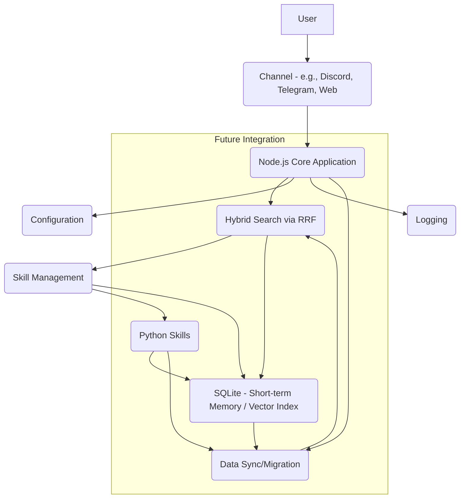
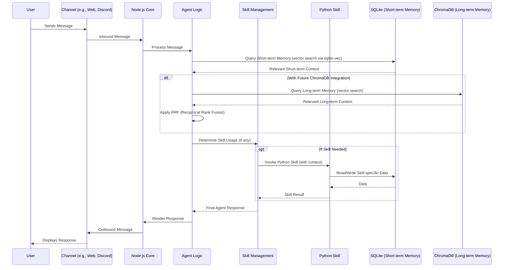

# OpenClaw Architecture Overview

This document outlines the current architecture of the OpenClaw project, focusing on the Node.js core, Python-based skills, and the data flow involving SQLite for short-term memory, with a planned integration of ChromaDB for long-term externalized memory.

## 1. Structural Overview

The OpenClaw system is primarily composed of a Node.js core application that manages various channels and agents. Skills, which can be implemented in Python, extend the functionality. Data persistence for short-term memory and vector indexing is currently handled by SQLite with the `sqlite-vec` extension. ChromaDB is envisioned as a future externalized memory layer for hybrid vector search.

## 2. Implementation Logic (Example: Message Processing with Memory Retrieval)

This sequence diagram illustrates a typical flow when a user message is processed, involving agent logic and memory retrieval from SQLite. It also indicates where ChromaDB would eventually be integrated for hybrid search.

## 3. Module Responsibilities

### Node.js Core Application
*   **Channels:** Handles inbound and outbound communication with external platforms (e.g., Discord, Telegram, WebSockets).
*   **Agent Logic:** Orchestrates the processing of messages, decision-making, and interaction with skills and memory.
*   **Skill Management:** Discovers, loads, and manages the execution of various skills, acting as a bridge between the Node.js core and potentially external skill environments (like Python).
*   **Memory Management:** Manages the interaction with the underlying data stores (currently SQLite, with planned ChromaDB integration). This includes embedding generation, indexing, storage, and retrieval.
*   **Configuration:** Manages application settings and agent-specific configurations.
*   **Logging:** Handles structured logging throughout the system.
*   **CLI:** Provides command-line interface for interaction and management.

### Python Skills
*   **Specialized Functionality:** Provides domain-specific logic and capabilities that extend the core agent's functionality.
*   **Data Interaction:** May interact with SQLite for skill-specific data persistence or external APIs.
*   **Python Execution Bridge:** Relies on the Node.js core's skill management to invoke Python scripts and exchange data.

### SQLite (Short-term Memory / Vector Index)
*   **Ephemeral Data Storage:** Stores recent conversational context, session-specific data, and agent states.
*   **Vector Indexing:** Utilizes `sqlite-vec` for efficient vector similarity search on embeddings derived from short-term memory.
*   **QMD Management:** Manages and queries indexed markdown content.

### ChromaDB (Long-term Externalized Memory - Planned)
*   **Scalable Vector Store:** Intended to provide a more robust and scalable solution for storing and retrieving vector embeddings for long-term memory.
*   **Hybrid Search Integration:** Will be integrated with SQLite via a Reciprocal Rank Fusion (RRF) strategy to combine results from both short-term and long-term memory.
*   **Externalized Persistence:** Provides a dedicated, potentially external service for persistent vector storage.
